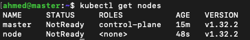

# Kubernetes Cluster Setup on Virtual Machines with containerd

## Overview

This guide explains how to set up a Kubernetes cluster on Ubuntu virtual machines (VMs) or bare-metal servers. It covers networking, installation of containerd, and best practices for a production-like environment.

## Prerequisites

- **Two Ubuntu VMs or bare-metal servers** (one master node, one worker node).
- **At least 2 CPUs and 2GB RAM per node**.
- **SSH access enabled** on both nodes.

---

## Step 1: Pre-Installation Best Practices

### Disable Swap

Kubernetes requires swap to be disabled. Run the following command:

```sh
sudo swapoff -a
sudo sed -i '/ swap / s/^/#/' /etc/fstab
```

### Enable IP Forwarding

Ensure `/etc/sysctl.conf` includes:

```sh
net.ipv4.ip_forward = 1
```

Apply changes:

```sh
sudo sysctl -p
```

### Allow Necessary Firewall Rules

```sh
sudo ufw allow 6443/tcp  # API server
sudo ufw allow 2379:2380/tcp  # etcd
sudo ufw allow 10250/tcp  # Kubelet
sudo ufw enable
```

---

## Step 2: Install containerd

### Install Dependencies

```sh
sudo apt update
sudo apt install -y containerd
```

### Configure containerd

```sh
sudo mkdir -p /etc/containerd
containerd config default | sudo tee /etc/containerd/config.toml
```

Ensure `SystemdCgroup` is enabled in `config.toml`:

```sh
sudo sed -i 's/SystemdCgroup = false/SystemdCgroup = true/' /etc/containerd/config.toml
```

Restart containerd:

```sh
sudo systemctl restart containerd
sudo systemctl enable containerd
```

Verify:

```sh
sudo systemctl status containerd
```

---

## Step 3: Install Kubernetes (kubeadm, kubelet, kubectl)

### Add Kubernetes Repository

```sh
sudo apt-get update
sudo apt-get install -y apt-transport-https ca-certificates curl gpg
curl -fsSL https://pkgs.k8s.io/core:/stable:/v1.32/deb/Release.key | sudo gpg --dearmor -o /etc/apt/keyrings/kubernetes-apt-keyring.gpg
echo 'deb [signed-by=/etc/apt/keyrings/kubernetes-apt-keyring.gpg] https://pkgs.k8s.io/core:/stable:/v1.32/deb/ /' | sudo tee /etc/apt/sources.list.d/kubernetes.list
```

### Install Kubernetes Components

```sh
sudo apt-get update
sudo apt-get install -y kubeadm kubelet kubectl
sudo systemctl enable kubelet
```

---


## Step 4: Initialize Kubernetes Cluster

On the **master node**, run:
```sh
sudo kubeadm init --pod-network-cidr=192.168.0.0/16 --cri-socket unix:///run/containerd/containerd.sock
```


Set up `kubectl` for the current user:
```sh
mkdir -p $HOME/.kube
sudo cp -i /etc/kubernetes/admin.conf $HOME/.kube/config
sudo chown $(id -u):$(id -g) $HOME/.kube/config
```

### Join Worker Nodes
On the **worker node**, run the join command from the master (replace with actual output from `kubeadm init`):
```sh
sudo kubeadm join <master-ip>:6443 --token <token> --discovery-token-ca-cert-hash sha256:<hash>
```


Verify nodes on master:
```sh
kubectl get nodes
```


---

## Step 5: Install a Pod Network (CNI)

Install **Calico** for networking:
```sh
kubectl apply -f https://docs.projectcalico.org/manifests/calico.yaml
```

Verify:
```sh
kubectl get pods -n kube-system
```


Verify nodes again:
```sh
kubectl get nodes
```


---
## Step 6: Restricting API Access

Checking access from the node:
```sh
kubectl get pods -A
```


Ensure API Server only listens to the master:
```sh
sudo vim /etc/kubernetes/manifests/kube-apiserver.yaml
```
Add this line:
```sh
- --bind-address=172.16.11.128
```

Set firewall rules to allow acces on port 6443 only from our network:
```sh
sudo ufw allow from 172.16.11.0/24 to any port 6443
```

Denying any other ip:
```sh
sudo ufw deny from any to any port 6443
sudo ufw reload
```

Verify from node:
```sh
kubectl get pods -A
```


---


## Step 7: Deploy Juice Shop Application

### Deploy Juice Shop
```sh
kubectl create deployment juice-shop --replicas 2 --image bkimminich/juice-shop --port 3000 --dry-run=client -o yaml > js.yaml
```

### This will generate a yaml file
```yaml
apiVersion: apps/v1
kind: Deployment
metadata:
  name: juice-shop
  labels:
    app: juice-shop
spec:
  replicas: 2
  selector:
    matchLabels:
      app: juice-shop
  template:
    metadata:
      labels:
        app: juice-shop
    spec:
      containers:
      - name: juice-shop
        image: bkimminich/juice-shop
        ports:
        - containerPort: 3000
```

```sh
kubectl apply -f js.yaml
```


### Create a Service for Juice Shop
```sh
kubectl expose deployment juice-shop --name juice-shop-service --type ClusterIP --port 80 --target-port=3000 --dry-run=client -o yaml > js-svc.yaml
```
```yaml
apiVersion: v1
kind: Service
metadata:
  name: juice-shop-service
spec:
  selector:
    app: juice-shop
  ports:
  - protocol: TCP
    port: 80
    targetPort: 3000
  type: ClusterIP
```

Apply:

```sh
kubectl apply -f js-svc.yaml
```


Test ClusterIP:


---

## Step 8: Deploy NGINX Ingress Controller

```sh
kubectl apply -f https://raw.githubusercontent.com/kubernetes/ingress-nginx/main/deploy/static/provider/cloud/deploy.yaml
```

Verify:

```sh
kubectl get pods -n ingress-nginx
```


### In bare-metal environments without native load balancer support, configure the Ingress controller to use NodePort for external traffic routing.
```sh
kubectl patch svc ingress-nginx-controller -n ingress-nginx -p '{"spec":{"type":"NodePort"}}'
```
---

## Step 9: Expose Juice Shop with Ingress

```yaml
apiVersion: networking.k8s.io/v1
kind: Ingress
metadata:
  name: juice-shop-ingress
  annotations:
    nginx.ingress.kubernetes.io/rewrite-target: /
spec:
  ingressClassName: nginx
  rules:
  - host:
    http:
      paths:
      - path: /
        pathType: Prefix
        backend:
          service:
            name: juice-shop-service
            port:
              number: 80
```

Apply:

```sh
kubectl apply -f ngress.yaml
```


### Test Ingress


---

## Step 10 Monitoring:
### A. Metrics & Cluster Health
#### **Tools**: Prometheus + Grafana  
- **Purpose**: Track node/pod resource usage and cluster health.  
- **Components**:
  - **Prometheus**: Collects cluster metrics.
  - **Grafana**: Provides dashboards for visualization.
- **Key Metrics to Track**:

  - **Node Health**: CPU, memory, and disk utilization.
  - **Pod Metrics**: Restart counts, resource limits, and throttling.
  - **API Server**: Request rates, error rates, and latency.
  - **Juice Shop**: HTTP request/response metrics (if exposed).

### B. Logging
#### **Tools**: EFK Stack (Elasticsearch + Fluentd + Kibana) / ELK Stack (Elasticsearch + Logstash + Kibana)
- **Purpose**: Aggregate and analyze logs from Kubernetes components and Juice Shop.

- **Components**:
  - **Elasticsearch**: Central log storage and indexing.
  - **Fluentd/Logstash**: log collectors (DaemonSet on nodes).
  - **Kibana**: Log visualization and querying.

- **Key Logs to Monitor**:
  - **Kubernetes**: API server audit logs, scheduler/controller-manager errors.
  - **Juice Shop**: HTTP access logs, authentication failures, 5xx errors.

---
